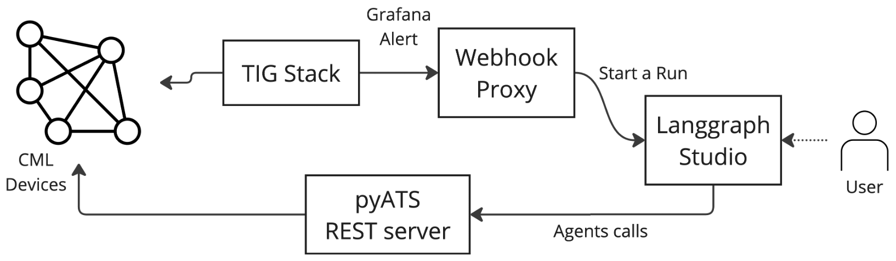
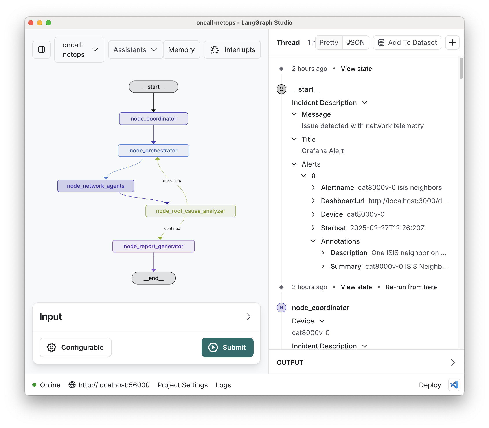
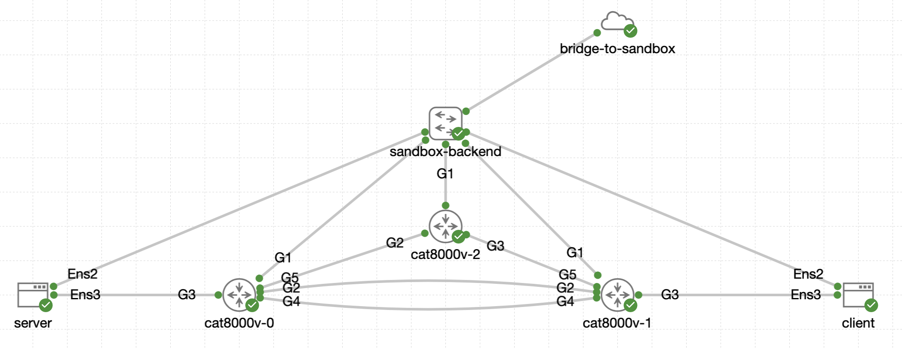
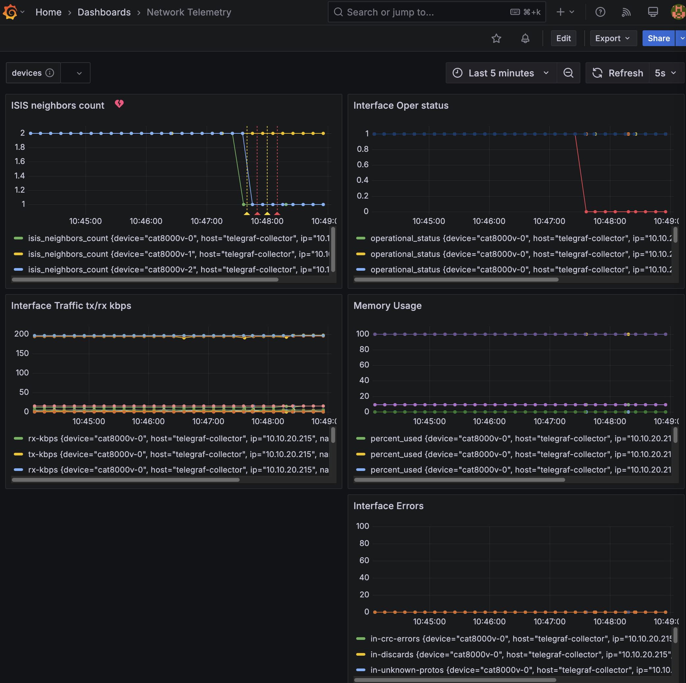
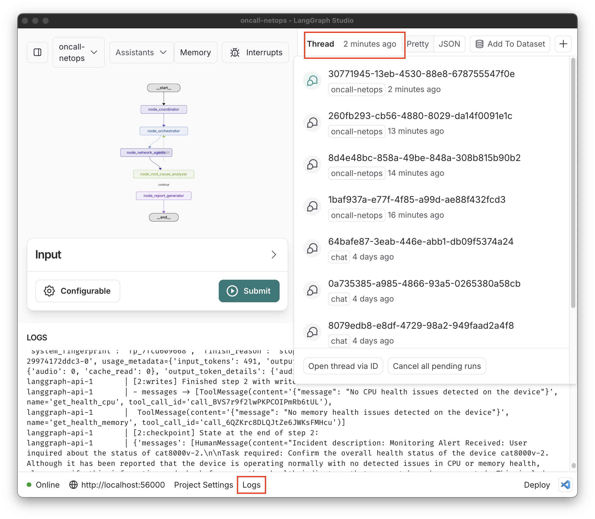
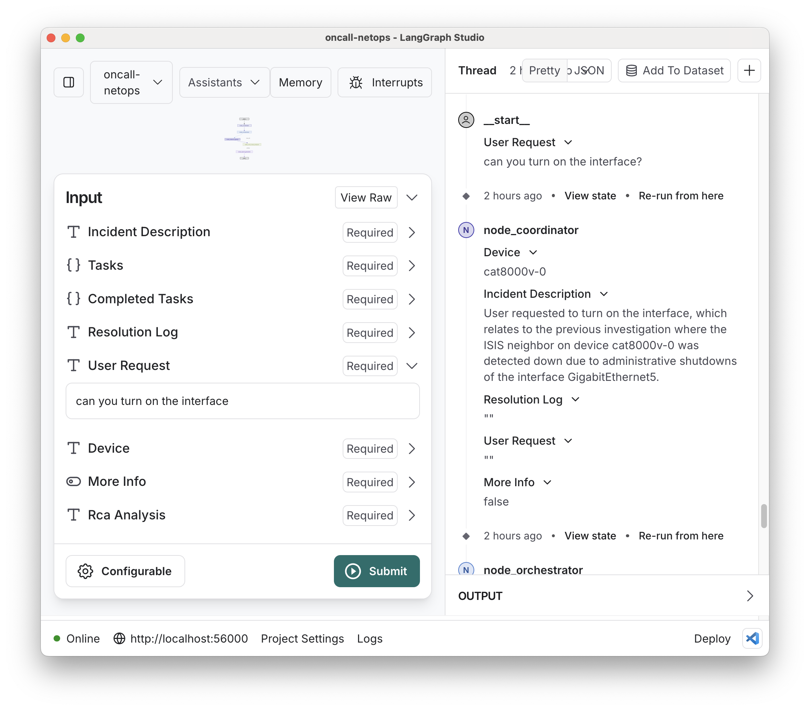

# OnCall NetOps + TIG + pyATS Demo 🚀

This Proof of Concept (PoC) demonstrates how a group of agents can work together to resolve a network issue, specifically an ISIS adjacency issue.

The TIG (Telegraf, InfluxDB, Grafana) stack monitors devices and sends an alert to Langgraph whenever an **ISIS neighbor is lost**. This alert triggers the agents to work, and you can review the summary on Langgraph Studio to decide the next steps.

You can watch the [demo in action](https://app.vidcast.io/share/adf2f997-5bc1-4160-937f-7251341fa133) (about 7 minutes, no sound).



## Components

The demo is split into three separate repositories:

- **OnCall-NetOps**: [GitHub repo.](https://github.com/jillesca/oncall-netops)
  - Graph of AI agents.
- **pyATS Server**: [GitHub repo.](https://github.com/jillesca/pyats_server)
  - Used by AI agents to interact with network devices.
- **Observability Stack**: [GitHub repo.](https://github.com/jillesca/observablity_tig)
  - Monitors network devices and trigger alarms.

## Graph 🤖

When the graph receives a request, the `node_coordinator` validates the info and passes it to the `node_orchestrator`, which decides which network agents to call. Each agent connects to devices, gathers data, and returns a report. When all agents finish, their reports go to the `node_root_cause_analyzer`, which determines the root cause. If more details are needed, it requests them from the `node_orchestrator`. Otherwise, it sends the final findings to the `node_report_generator`.

Network agents:

- `agent_isis`: Retrieves ISIS info.
- `agent_routing`: Retrieves routing info.
- `agent_log_analyzer`: Checks logs.
- `agent_device_health`: Retrieves device health.
- `agent_network_interface`: Retrieves interfaces/config.
- `agent_interface_actions`: Performs interface actions.



## Requirements ⚠️

- **[uv](https://docs.astral.sh/uv/getting-started/installation/)**: Fast Python package manager and project manager. Required to run the LangGraph server.
- **Python 3.11+**
- **Docker >=1.27**
- **Make**
- **OpenAI Key**
- **Langsmith Key**: [Create a token](https://docs.smith.langchain.com/administration/how_to_guides/organization_management/create_account_api_key) and copy the Langsmith environment variables.
- **CML**: Import and start the [topology](cml/topology.yaml).
  - If you don't have a CML instance, you can use the [DevNet CML Sandbox](https://devnetsandbox.cisco.com/DevNet/) or the [CML free version](https://developer.cisco.com/docs/modeling-labs/cml-free/), which allows up to 5 nodes to run simultaneously.

Create an `.env` file in the root directory and set your keys there.

<details>
<summary>Example .env file</summary>

```bash
LANGSMITH_TRACING=true
LANGSMITH_ENDPOINT="https://api.smith.langchain.com"
LANGSMITH_API_KEY=<langsmith_token>
LANGSMITH_PROJECT="oncall-netops"
OPENAI_API_KEY=<openai_token>
```

</details>

## Build ⚙️

1. Import the remote repositories used as `git` submodules:

   ```bash
   make build-repos
   ```

2. Build the TIG stack, pyATS server, and webhook proxy. You can deploy each component separately (refer to their respective repositories for more info).

   ```bash
   make build-demo
   ```

> [!NOTE]
> If any required environment variable is missing, the `make` target will **fail** and print which environment variable is missing.

## Run Langgraph

> [!NOTE] > **Update**: LangGraph Studio Desktop has been discontinued by LangChain. The only available option is now the LangGraph Server CLI with the web-based Studio interface.

Use the LangGraph Server CLI to run the server in the terminal. You can access the web version of LangGraph Studio through your browser.

### Review Environment Variables

- `PYATS_API_SERVER`
  - This variable connects the Langgraph API server to the pyATS server.
  - Defaults to `http://localhost:57000`.
  - Adjust this value ([see .env.example](.env.example#L5)) if needed.
  - Default port for the pyATS server is `57000`.
- `LANGGRAPH_API_HOST`
  - Links the `grafana-to-langgraph-proxy` with the Langgraph API server.
  - Defaults to `http://host.docker.internal:56000`,
  - [Adjust](https://github.com/jillesca/oncall-netops/blob/main/.env.example#L4) if needed.

See the [.env.example](.env.example) file for the rest of the environment variables used. These are set by the [Makefile](Makefile).

### Running LangGraph Server CLI 💻

Dependencies are automatically managed by `uv` during the build process.

Start the server with:

```bash
make run-environment
```

<details>
<summary>Example output</summary>

```bash
❯ make run-environment
langgraph dev --port 56000
WARNING:langgraph_api.cli:python_dotenv is not installed. Environment variables will not be available.
INFO:langgraph_api.cli:

        Welcome to

╦  ┌─┐┌┐┌┌─┐╔═╗┬─┐┌─┐┌─┐┬ ┬
║  ├─┤││││ ┬║ ╦├┬┘├─┤├─┘├─┤
╩═╝┴ ┴┘└┘└─┘╚═╝┴└─┴ ┴┴  ┴ ┴

- 🚀 API: http://127.0.0.1:56000
- 🎨 Studio UI: https://smith.langchain.com/studio/?baseUrl=http://127.0.0.1:56000
- 📚 API Docs: http://127.0.0.1:56000/docs

This in-memory server is designed for development and testing.
For production use, please use LangGraph Cloud.
```

</details>

If you have issues with the web version, make sure:

- You are logged in to Langsmith.
- Refresh your browser.

If you don't want to use the web version, you can still see the operations in the terminal, but it is hard to follow and interact with due to the amount of output.

## Run



There are three devices involved in this demo. They run ISIS between them. You can inspect the topology [here](cml/topology.yaml).

The use case built in this demo is when an ISIS neighbor is lost. Grafana detects the lost neighbor and sends an automatic alert to the graph. You can replicate the scenario by shutting down an ISIS interface like `GigabitEthernet5` on `cat8000-v0` of the XE devices and see what happens.



The alert triggers a background job in Langgraph Studio. _You won't be able to see_ the graph running in the GUI until it finishes (tool limitation at this point). Inspect the logs if you want to see what is happening.



Once the graph is finished, you can see the results and interact with the agents. The threads won't autorefresh to show you the output. Switch to another thread and go back to see the results. Use the _User Request_ field to interact with the graph about the alert received.



> [!NOTE]
> If you’re curious about the other inputs, they’re used by the agents for different tasks. This is the state shared across the agents.

You can also use the graph to interact with the network devices without an alert. If so, **use** the same _User Request_ field and provide the device hostname: `cat8000v-0`, `cat8000v-1`, or `cat8000v-2` (a future improvement).

## Traces 🔍

Here you can see the traces from one execution of the demo. There you can find state, runs, inputs, and outputs.

- Graph triggered by an automatic alert: [Trace](https://smith.langchain.com/public/42aac689-24a7-4a85-95b4-666c240d2c5b/r)
- Graph triggered by a user request following up on the alert: [Trace](https://smith.langchain.com/public/e034429e-6b20-4da0-bd74-25034fbdc243/r)

### Useful resources 📚

- [Building effective agents by Anthropic](https://www.anthropic.com/research/building-effective-agents)
- [Course. Introduction to LangGraph](https://academy.langchain.com/courses/intro-to-langgraph)
- [Scientific paper agent using LangGraph](https://github.com/NirDiamant/GenAI_Agents/blob/main/all_agents_tutorials/scientific_paper_agent_langgraph.ipynb)
- [Previous demo with only one agent](https://github.com/jillesca/AI-Network-Troubleshooting-PoC)
