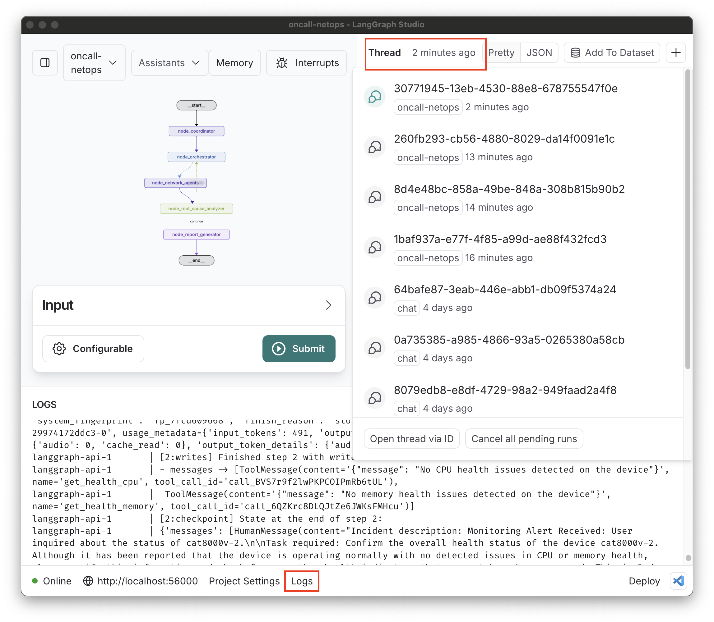

# OnCall NetOps + TIG + pyATS Demo 🚀

This Proof of Concept (PoC) demonstrates how a group of agents can work together to resolve a network issue, specifically an ISIS adjacency issue.

The TIG (Telegraf, InfluxDB, Grafana) stack monitors devices and sends an alert to Langgraph whenever an **ISIS neighbor is lost**. This alert triggers the agents to work, and you can review the summary on Langgraph Studio to decide the next steps.

You can watch the [demo in action](https://app.vidcast.io/share/adf2f997-5bc1-4160-937f-7251341fa133) (about 7 minutes, no sound).


## Components

The demo is split into three separate repositories:

- **OnCall-NetOps**: [GitHub repo.](https://github.com/jillesca/oncall-netops)
  - Graph of AI agents.
- **pyATS Server**: [GitHub repo.](https://github.com/jillesca/pyats_server)
  - Used by AI agents to interact with network devices.
- **Observability Stack**: [GitHub repo.](https://github.com/jillesca/observablity_tig)
  - Monitors network devices and trigger alarms.

## Graph 🤖

When the graph receives a request, the `node_coordinator` validates the info and passes it to the `node_orchestrator`, which decides which network agents to call. Each agent connects to devices, gathers data, and returns a report. When all agents finish, their reports go to the `node_root_cause_analyzer`, which determines the root cause. If more details are needed, it requests them from the `node_orchestrator`. Otherwise, it sends the final findings to the `node_report_generator`.

Network agents:

- `agent_isis`: Retrieves ISIS info.
- `agent_routing`: Retrieves routing info.
- `agent_log_analyzer`: Checks logs.
- `agent_device_health`: Retrieves device health.
- `agent_network_interface`: Retrieves interfaces/config.
- `agent_interface_actions`: Performs interface actions.


## Requirements ⚠️

- **Python 3.11** (Only for the _Langgraph Studio Desktop_ version).
- **Docker >=1.27**
- **Make**
- **OpenAI Key**
- **Langsmith Key**: [Create a token](https://docs.smith.langchain.com/administration/how_to_guides/organization_management/create_account_api_key) and copy the Langsmith environment variables.
- **CML**: Import and start the [topology](cml/topology.yaml).
  - If you don't have a CML instance, you can use the [DevNet CML Sandbox](https://devnetsandbox.cisco.com/DevNet/) or the [CML free version](https://developer.cisco.com/docs/modeling-labs/cml-free/), which allows up to 5 nodes to run simultaneously.

Create an `.env` file in the root directory and set your keys there.

<details>
<summary>Example .env file</summary>

```bash
LANGSMITH_TRACING=true
LANGSMITH_ENDPOINT="https://api.smith.langchain.com"
LANGSMITH_API_KEY=<langsmith_token>
LANGSMITH_PROJECT="oncall-netops"
OPENAI_API_KEY=<openai_token>
```

</details>

## Build ⚙️

1. Import the remote repositories used as `git` submodules:

   ```bash
   make build-repos
   ```

2. Build the TIG stack, pyATS server, and webhook proxy. You can deploy each component separately (refer to their respective repositories for more info).

   ```bash
   make build-demo
   ```

> [!NOTE]
> If any required environment variable is missing, the `make` target will **fail** and print which environment variable is missing.

## Run Langgraph

There are two options to run the graph:

1. **Langgraph Server CLI**: Run the server in the terminal without a container. You can use the web version of Langgraph Studio (a bit slower).
2. **Langgraph Studio Desktop**: Desktop version (only for Mac).

### Review Environment Variables

- `PYATS_API_SERVER`: This variable connects the Langgraph API server to the pyATS server. It defaults to `http://host.docker.internal:57000`. **Note** that the demo _assumes_ you're running the Langgraph server in a container, so adjust this value ([see .env.example](.env.example#L5)) if needed. Default port for the pyATS server is `57000`.
- `LANGGRAPH_API_HOST`: Links the `grafana-to-langgraph-proxy` with the Langgraph API server. Defaults to `http://host.docker.internal:56000`, [adjust](https://github.com/jillesca/oncall-netops/blob/main/.env.example#L4) if needed.

If you need to adjust these environment variables, use the table below.

| Scenario                                                                                                         | Variable             | Value                              |
| ---------------------------------------------------------------------------------------------------------------- | -------------------- | ---------------------------------- |
| `grafana-to-langgraph-proxy`, pyATS Server, and Langgraph API Server on the same host. Langgraph in a container. | `PYATS_API_SERVER`   | `http://host.docker.internal:PORT` |
|                                                                                                                  | `LANGGRAPH_API_HOST` | `http://host.docker.internal:PORT` |
| `grafana-to-langgraph-proxy`, pyATS Server, & Langgraph API Server on different hosts or not in containers       | `PYATS_API_SERVER`   | `http://<HOST_IP:PORT>`            |
|                                                                                                                  | `LANGGRAPH_API_HOST` | `http://<HOST_IP:PORT>`            |

See the [.env.example](.env.example) file for the rest of the environment variables used. These are set by the [Makefile](Makefile).

### Option 1: Langgraph Server CLI 💻

Install the dependencies listed in the [requirements file](https://github.com/jillesca/oncall-netops/blob/main/requirements.txt), using a virtual environment if possible.

Start the server with:

```bash
make run-environment
```

<details>
<summary>Example output</summary>

```bash
❯ make run-environment
langgraph up --port 56000 --watch --recreate
Starting LangGraph API server...
For local dev, requires env var LANGSMITH_API_KEY with access to LangGraph Cloud closed beta.
For production use, requires a license key in env var LANGGRAPH_CLOUD_LICENSE_KEY.
- Pulling...Error response from daemon: get langgraph-data: no such volume
Ready!
- API: http://localhost:56000
- Docs: http://localhost:56000/docs
- LangGraph Studio: https://smith.langchain.com/studio/?baseUrl=http://127.0.0.1:56000
```

</details>

Open the LangGraph Studio URL using Chrome (Firefox doesn't work).

If you have issues with the web version, make sure:

- You are logged in to Langsmith.
- Refresh your browser.

If you don't want to use the web version, you can still see the operations in the terminal, but it is hard to follow and interact with due to the amount of output.

### Option 2: Langgraph Studio Desktop 🍏

[Download the desktop version](https://studio.langchain.com/) (only for Mac).

**Before** you start opening the project, **set the target port** in the bottom bar. This project uses port `56000`. If you set a different one, update the environment variable [LANGGRAPH_API_PORT](https://github.com/jillesca/oncall-netops/blob/main/.env.example#L2).

<p align="center">
  
<p>

On Langgraph Studio, select this project and open it. This imports the code from this repo and installs everything in a dedicated container.

<p align="center">
  
<p>

> [!NOTE]
> Sometimes the build process fails. Restart or retry.

## Run


There are three devices involved in this demo. They run ISIS between them. You can inspect the topology [here](cml/topology.yaml).

The use case built in this demo is when an ISIS neighbor is lost. Grafana detects the lost neighbor and sends an automatic alert to the graph. You can replicate the scenario by shutting down an ISIS interface like `GigabitEthernet5` on `cat8000-v0` of the XE devices and see what happens.


The alert triggers a background job in Langgraph Studio. _You won't be able to see_ the graph running in the GUI until it finishes (tool limitation at this point). Inspect the logs if you want to see what is happening.



Once the graph is finished, you can see the results and interact with the agents. The threads won't autorefresh to show you the output. Switch to another thread and go back to see the results. Use the _User Request_ field to interact with the graph about the alert received.


> [!NOTE]
> If you’re curious about the other inputs, they’re used by the agents for different tasks. This is the state shared across the agents.

You can also use the graph to interact with the network devices without an alert. If so, **use** the same _User Request_ field and provide the device hostname: `cat8000v-0`, `cat8000v-1`, or `cat8000v-2` (a future improvement).

## Traces 🔍

Here you can see the traces from one execution of the demo. There you can find state, runs, inputs, and outputs.

- Graph triggered by an automatic alert: [Trace](https://smith.langchain.com/public/42aac689-24a7-4a85-95b4-666c240d2c5b/r)
- Graph triggered by a user request following up on the alert: [Trace](https://smith.langchain.com/public/e034429e-6b20-4da0-bd74-25034fbdc243/r)

## FAQ

A common error with Langgraph Studio is when you restart the server and orphan containers from another Langgraph instance are still running, causing the server to fail.

If you have this problem, see orphan containers with:

```bash
docker ps --filter "name=oncall-netops"
```

Remove them with:

```bash
docker ps --filter "name=oncall-netops" --format "{{.ID}}" | xargs docker rm -f
```

Restart Langgraph Studio.

## Additional Resources

- [Previous demo with only one agent](https://github.com/jillesca/AI-Network-Troubleshooting-PoC)
